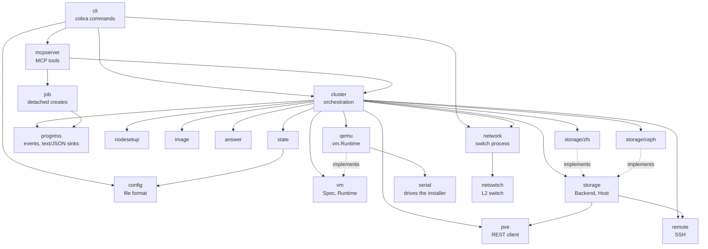
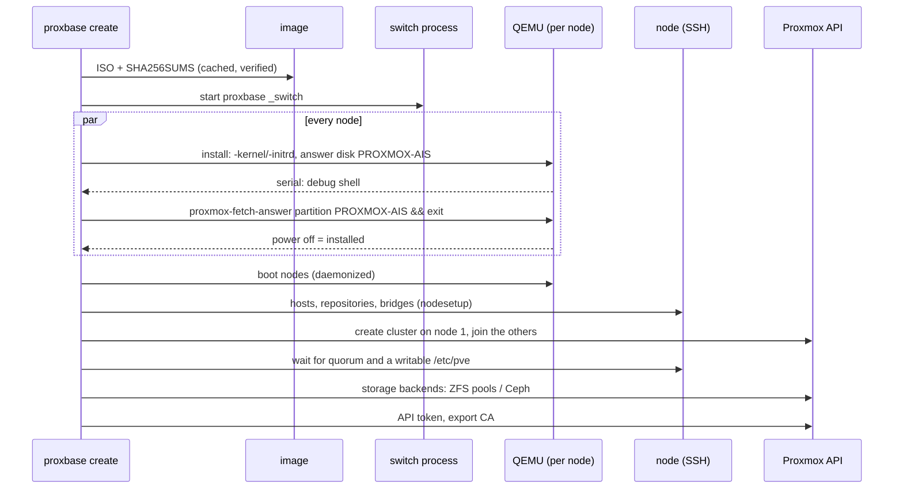
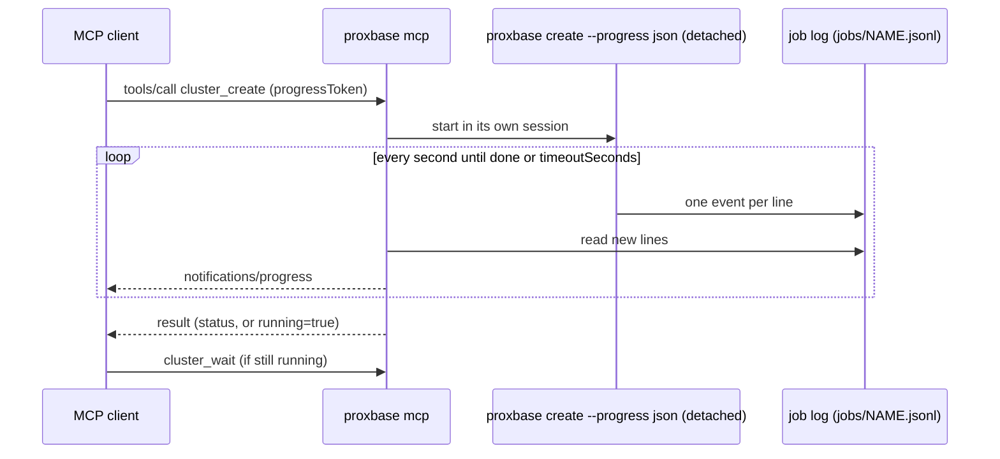

# Architecture

Proxbase is a single Go binary. `create` turns a cluster file into a desired state,
starts one QEMU process per node and then runs idempotent steps against each node
(SSH) and the Proxmox API until the cluster matches the file. There is no daemon
apart from one small switch process per running cluster.

## Packages



| Package | Responsibility |
| --- | --- |
| `config` | Cluster file: types, defaults, validation, JSON schema |
| `state` | On-disk layout of a cluster, `state.json`, secrets, locking |
| `image` | Download, verify and cache ISOs; extract the installer kernel and command line |
| `answer` | Render the installer's `answer.toml` |
| `vm` | Hypervisor-neutral node description and the runtime interfaces |
| `qemu` | QEMU runtime: command lines with fixed PCI slots, install, start/stop via pidfile and QMP, qcow2 snapshots |
| `serial` | Answer the installer's debug shell over the serial console and log it |
| `netswitch` | Learning L2 switch over unix datagram sockets |
| `network` | The per-cluster switch process, the nodes' NIC sockets and network faults (`run/faults.json`) |
| `nodesetup` | Shell scripts that prepare nodes (hosts, repositories, bridges, upgrades) |
| `storage`, `storage/zfs`, `storage/ceph` | Storage backend contract and implementations |
| `pve` | Proxmox VE REST client with certificate pinning and task helpers |
| `remote` | SSH to nodes through the forwarded ports |
| `retry` | Retry with timeout, interval and permanent errors |
| `golden` | Cached base images and the personalization of cloned nodes |
| `cluster` | Orchestration: create, lifecycle, nodes, snapshots, faults, status, exec |
| `progress` | Progress events and sinks: text, JSON lines, MCP notifications |
| `job` | Runs a create detached from its caller, with a JSON-lines progress log |
| `mcpserver` | MCP server (`proxbase mcp`): tools, the schema resource, progress forwarding |
| `cli` | Commands, flags and output |

Extension points are small interfaces: a new hypervisor implements `vm.Runtime` (and
optionally `vm.FaultInjector` for `proxbase fault`), a new
storage backend implements `storage.Backend` (plus optional `Waiter`,
`StopPreparer`, `NodeRemover`, `HealthReporter`), and a different network backend
(for example host bridges) would replace `network.Switch`.

## Create



Each step checks first and skips what is done, so a failed create resumes when run
again. Progress (`installed` per node, phase, errors) is kept in `state.json`.

## Progress and the MCP server

Long operations report through a `progress.Sink` (a function taking an `Event`).
The CLI passes a text or JSON-lines sink for stderr (`--progress`); the MCP server
passes one that also forwards events as MCP progress notifications.



The create runs as a separate process so it survives client timeouts and restarts
of the MCP server; everything else (`node_exec`, `cluster_start`, snapshots, faults)
runs in the server process, guarded by the same cluster lock as the CLI.

## Nodes

- QEMU/KVM with q35, SeaBIOS and fixed PCI addresses for every device, identical
  for install and run, so interface names never change between them.
- NIC 0 is QEMU user networking (`vmbr0`, NAT, port forwards); NIC 1..n are unix
  datagram sockets to the switch. MACs are derived from node and NIC number.
- The installer runs in the foreground (killed if proxbase dies); installed nodes run
  daemonized with a pidfile, a QMP socket and a serial console socket with a log file.
- Stop: ACPI powerdown via QMP, `quit` after the timeout, then SIGKILL.

## Trust

- Each cluster has a generated root password and ed25519 key; SSH host keys are
  recorded on first use and checked afterwards.
- During setup the API client pins each node's certificate fingerprint (read over
  SSH); afterwards clients verify against the exported cluster CA, ignoring the host
  name because nodes are reached through `127.0.0.1`.

## State on disk

```text
~/.local/share/proxbase/clusters/<name>/
├── cluster.yaml        resolved configuration (source of truth)
├── state.json          phase, nodes, ports, host keys, snapshots
├── lock                flock for mutating commands
├── secrets/            root-password, id_ed25519(.pub), api-token, pve-root-ca.pem (0600)
├── disks/              <node>-root.qcow2, <node>-dataN.qcow2
├── run/                pidfiles, QMP/console sockets, switch and NIC sockets
└── logs/               install, console, QEMU and switch logs
~/.local/share/proxbase/jobs/  <cluster>.jsonl, .pid, .yaml of creates started over MCP
~/.cache/proxbase/iso/     ISOs, SHA256SUMS, extracted installer files
~/.cache/proxbase/images/  golden base images (create --golden)
```

Design decisions and measurements are in [research/feasibility.md](research/feasibility.md).
