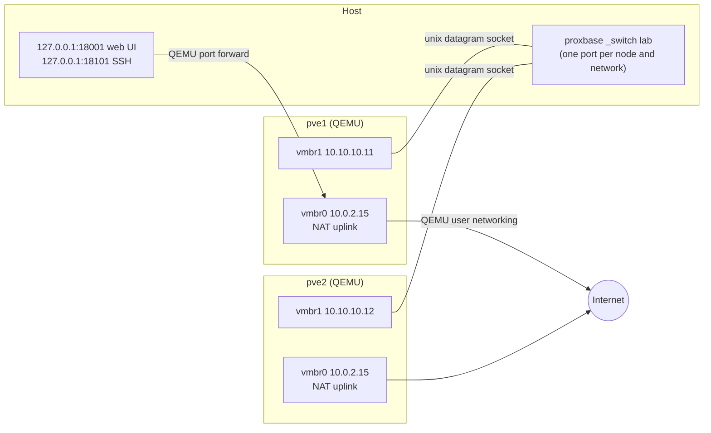

# Networking

Proxbase needs no root privileges for networking. Every node has one NAT uplink and
one NIC per configured network; the internal networks are connected by a small
switch process per cluster.



## NAT uplink (`vmbr0`)

QEMU user networking: each node is `10.0.2.15/24` behind its own NAT with gateway
`10.0.2.2` and DNS `10.0.2.3`. It provides:

- internet access for the node (package installs, Ceph)
- port forwards from the host: node N's web UI/API on `access.portBase + N`, SSH on
  `access.portBase + 100 + N`, bound to `access.bindAddress` (default `127.0.0.1`)
- internet for nested guests bridged to `vmbr0`: they get DHCP leases from
  `10.0.2.100` on (up to 16 per node). After a live migration a guest keeps its
  address, which then belongs to another node's NAT; good enough for a lab.

Nodes cannot reach each other over `vmbr0`; use the internal networks for that.

## Internal networks

Each entry in `networks` adds a virtio NIC with a fixed PCI address and MAC and a
Linux bridge in the node (`/etc/network/interfaces`, managed between
`# proxbase-begin` and `# proxbase-end`). With a `cidr`, node N gets the address
`.1N` (`pve1` = `.11`); without one the bridge is L2 only.

The switch is a learning L2 switch over unix datagram sockets: it accepts frames only
from the cluster's own nodes, never echoes frames back to the sender and passes VLAN
tags through. It starts before the nodes, keeps running while they do, and reloads
its port list when nodes are added or removed.

## Roles

| Role | Effect |
| --- | --- |
| `corosync` | First network with the role: corosync link0, and node names resolve to it in `/etc/hosts`. Second: link1 (redundant ring) |
| `ceph-public` | Ceph public network (monitors, clients). Default: corosync link0 |
| `ceph-cluster` | Ceph replication network. Default: the public network |
| `migration` | Live migration network (`datacenter.cfg`, `type=secure`) |

If no network has the `corosync` role, the first network with a `cidr` gets it.

## VLANs and MTU

```yaml
networks:
  - {name: cluster, cidr: 10.10.10.0/24, roles: [corosync]}
  - {name: storage, cidr: 10.10.20.0/24, mtu: 9000, roles: [ceph-public]}
  - {name: guests, vlanAware: true, vlans: ["100", "200-299"]}
```

- `vlanAware: true` makes a VLAN-aware bridge; `vlans` limits the allowed VLANs
  (`bridge-vids`, default `2-4094`). Guests attach with `bridge=vmbr3,tag=100`.
- `mtu` is applied to the NIC and the bridge. Jumbo frames work end to end:
  `ping -M do -s 8972` between nodes on the storage network succeeds.

See [examples/networks.yaml](../examples/networks.yaml) for a cluster with separate
management, cluster, storage, replication and guest networks.

## Host-reachable networks

Bridge mode (nodes on a real host bridge) needs root or `CAP_NET_ADMIN` and is not
implemented yet; see the [design](bridge-mode.md).
